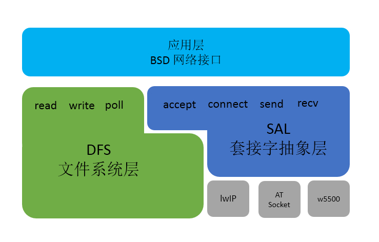

# SAL - 套接字抽象层 #

## 简介 ##

为了适配更多的网络协议栈类型，避免系统对单一网络协议栈的依赖，RT-Thread 系统提供 SAL（套接字抽象层）组件，该组件完成对不同网络协议栈接口的抽象并对上层提供一组标准的 BSD Socket API，这样开发者只需要关心和使用网络应用层提供的网络接口，而无需关心底层使用具体网络协议栈类型，极大的提过的系统的兼容性，方便开发者使用。

主要功能特点：

- 抽象、统一多种网络协议栈接口；
- 支持标准 BSD Socket API；
- 自定义协议栈注册方式；

## 网络框架 ##

RT-Thread 的网络框架主要采用四层结构形式， 如图 **SAL 网络框架图**所示：



最顶层是网络应用层，提供一套标准的网络编程接口，如 socket、connect 等函数，RT-Thread 系统中开发者只需要使用标准应用层接口就可以进行大部分网络开发。

第二层为网络虚拟文件系统，在 RT-Thread 系统中，通过虚拟文件系统 DFS，程序可以使用标准的接口函数对不同的文件系统，甚至不同介质上的文件系统进行读写操作。网络套接字接口也是支持虚拟文件系统结构，使用网络套接字接口时创建的网络套接字描述符由文件系统统一管理，所以网络套接字描述符也可使用标准文件操作接口，如 read、write等。

第三层为套接字抽象层，通过它 RT-Thread 系统能够适配下层不同的网络协议栈，并提供给上层统一的网络编程接口，方便不同协议栈的接入。

第四层为协议栈层，该层包括几种常用的 TCP/IP 协议栈，例如嵌入式领域常用的轻型 TCP/IP 协议栈 lwIP 以及 AT Socket 协议栈等。这些协议栈直接和硬件接触，完成数据从网络层到传输层的转化。

RT-Thread 的网络应用层提供的接口主要以标准 BSD Socket API为主，这样也能够保证程序可以在PC 上编写、调试，然后再移植到 RT-Thread 操作系统上。

## 工作原理 ###

SAL 组件主要实现的两个功能：支持多个协议栈和抽象统一的接口函数。对于不同的协议栈，网络接口的名称各不相同，以 connect 连接函数为例，lwIP 协议栈中接口名称为 lwip_connect ，而 AT socket 协议栈中接口名称为 at_connect。为了同时支持这两种协议栈，并且使用统一接口，SAL 组件实现通过 socket 创建时传入的协议簇类型判断使用哪种协议簇的功能。

    int socket(int domain, int type, int protocol);

上述为标准 BSD Socket API 中 socket 函数定义，其中 domain 表示协议域又称为协议簇（family），用于判断使用哪种协议簇，常见的有 AF_INET、AF_INET6 等。 SAL 组件中就是通过判断 socket 创建时传入的协议簇类型，定位该 socket 使用的协议栈类型。目前支持的如下两种协议栈：

- lwIP 协议栈： family = AF_INET、sec_family = AF_INET

- AT Socket 协议栈： family = AF_AT、sec_family = AF_INET

 AT socket 协议栈是 RT-Thread 系统自主研发的基于 AT 组件的简单网络协议栈，其设备的连接和数据的通讯都是通过 AT 命令完成，支持 BSD Socket API 标准。
 
 SAL 组件中每个协议簇类型存在一个结构体，由协议簇列表统一管理，协议簇结构体中定义了该协议栈的执行函数，如 lwIP 协议栈中的 lwip_socket、lwip_connect 等函数。 SAL 组件中每个创建的 socket 也存在一个结构体，由 socket 列表统一管理，socket 结构体中存放当前 socket 的执行函数和基本信息，在 socket 创建时通过判断传入协议簇类型，注册对应协议簇执行函数到 socket 结构体执行函数中。之后，使用该 socket 进行函数操作时，主要是获取 socket 结构体中的协议簇执行函数，完成函数操作。如下代码为 connect 函数示例：

 ```c
int connect(int s, const struct sockaddr *name, socklen_t namelen)
{
    /* 获取 SAL 套接字描述符 */
    int socket = dfs_net_getsocket(s);

    /* 通过 SAL 套接字描述符执行 sal_connect 函数 */
    return sal_connect(socket, name, namelen);
}

int sal_connect(int socket, const struct sockaddr *name, socklen_t namelen)
{
    struct socket *sock;

    /* 通过 SAL 套接字描述符获取 socket 结构体 */
    sock = sal_get_socket(socket);
    if (!sock)
    {
        return -1;
    }

    if (sock->ops->connect == RT_NULL)
    {
        return -RT_ENOSYS;
    }

    /* 调用获取结构体中对应的协议簇执行函数 */
    return sock->ops->connect((int) sock->user_data, name, namelen);
}
 ```

## 配置选项 ##

当我们使用 SAL 组件时需要在 rtconfig.h 中定义如下配置：

```c
#define RT_USING_SAL
#define SAL_USING_LWIP
#define SAL_USING_AT
#define SAL_SOCKETS_NUM 16
#define SAL_PROTO_FAMILIES_NUM 4
```

- `RT_USING_SAL`： 用于开启 SAL 功能；
- `SAL_USING_LWIP`： 用于开启 lwIP 协议栈支持； 
- `SAL_USING_AT`：用于开启 AT Socket 协议栈支持；

> 目前 SAL 抽象层只支持 lwIP 协 议栈和 AT Socket 协议栈，系统中开启 SAL 需要至少开启一种协议栈支持。

- `SAL_SOCKETS_NUM`：支持最大的 socket 创建数量；
- `SAL_PROTO_FAMILIES_NUM`: 支持最大的同时开启的协议栈数量；

上面配置选项可以直接在 `rtconfig.h` 文件中添加使用，也可以通过组件包管理工具 ENV 配置选项加入，ENV 中具体路径如下：

```C
RT-Thread Components  ---> 
     Network stack  --->
        Socket abstraction layer  --->  
        [*] Enable socket abstraction layer
               protocol family type  --->
         (16)  the number of socket
         (4)   the number of protocol family 
```

配置完成可以通过 scons 命令重新生成功能，完成 SAL 组件的添加。

## 初始化 ##

配置开启 SAL 选项之后，需要在启动时对它进行初始化，开启 SAL 功能，如果程序中已经使用了组件自动初始化，则不再需要额外进行单独的初始化，否则需要在初始化任务中调用如下函数：

    int sal_init(void);

该初始化函数主要是对 SAL 组件初始化状态的显示，防止组件重复初始化，以及对组件中使用的互斥锁等资源的初始化。 SAL 组件中没有创建新的线程，这也意味着 SAL 组件资源占用极小，可以适用于多种不同的设备上。

除了 SAL 组件的初始化，我们在使用 SAL 组件是还需要对支持的协议栈进行初始化。开启 SAL 组件最少开启一种协议栈支持，目前 SAL 组件只支持 lwIP 和 AT Socket 两种。对于协议栈的支持，主要是完成以下初始化及协议簇注册过程，确保 socket 创建时能找到对应的协议栈类型。

如果开启 lwIP 支持，需要在 SAL 组件中对 lwIP 协议栈的进行注册初始化，主要是在 `sal_socket/proto/lwip/af_inet_lwip.c` 文件中完成，如果文件中已经完成自动初始化则可忽略，如果没有则需要调用如下初始化函数：

    int lwip_inet_init(void)；

如果开启 AT Socket 支持，需要在 SAL 组件中对于 AT Socket 协议栈的进行注册初始化，主要是在 `sal_socket/proto/at/src/af_inet_at.c` 文件中完成，如果文件中已经完成自动初始化则可忽略，如果没有则需要调用如下初始化函数：

    int at_inet_init(void)；

初始化完成之后就可以正常使用 SAL 组件，使用抽象的标准网络接口函数编程。

## API 接口介绍 ##

SAL 组件抽象出标准 BSD Socket API 接口，如下是对常用网络接口的介绍：

### 创建套接字

`int socket(int domain, int type, int protocol);`

用于根据指定的地址族、数据类型和协议来分配一个套接字描述符及其所用的资源。

| 参数              | 描述                                |
|:------------------|:------------------------------------|
|domain             | 协议族类型                            |
|type               | 协议类型                              |
|protocol           | 实际使用的运输层协议                   |
| **返回**          | **描述**                              |
|0                  | 成功，返回一个代表套接字描述符的整数     |
|-1                 | 失败                                  |

**domain**

 协议族

- PF_INET： IPv4 
- PF_INET6： IPv6.

**type** 

协议类型

- SOCK_STREAM： 可靠的面向连接的服务或者 Stream Sockets
- SOCK_DGRAM： 数据包服务或者 Datagram Sockets
- SOCK_RAW： 网络层的原始协议

### 绑定套接字 

`int bind(int s, const struct sockaddr *name, socklen_t namelen);`

给套接字分配一个地址。当使用 `socket()` 创造一个套接字时, 只是给定了协议族,并没有分配地址。在套接字能够接受来自其他主机的连接前，必须用 `bind()` 给它绑定一个地址。  

| 参数              | 描述                                          |
|:------------------|:------------------------------------         |
|s                  | 套接字描述符                                  |
|name               | 指向 `sockaddr` 结构体的指针，代表要绑定的地址  |
|namelen            | sockaddr结构体的长度                          |
| **返回**          | **描述**                                      |
|0                  | 成功                                          |
|-1                 | 失败                                          |

### 监听套接字

`int listen(int s, int backlog);`

一旦一个套接字和一个地址联系之后，`listen()` 监听到来的连接。但是这只适用于对面向连接的模式，例如 套接字类型是 （`SOCK_STREAM`， `SOCK_SEQPACKET`）。

| 参数              | 描述                                 |
|:------------------|:------------------------------------|
|s                  | 套接字描述符                         |
|backlog            | 表示一次能够等待的最大连接数目        |
| **返回**          | **描述**                            |
|0                  | 成功                                |
|-1                 | 失败                                |

### 接收连接

`int accept(int s, struct sockaddr *addr, socklen_t *addrlen);`

当应用程序监听来自其他主机的面对数据流的连接时,必须用 `accept()` 函数初始化连接，`accept()` 为每个连接创立新的套接字并从监听队列中移除这个连接。 

| 参数              | 描述                                 |
|:------------------|:------------------------------------|
|s                  | 套接字描述符                         |
|addr               | 客户端设备地址信息                   |
|addrlen            | 客户端设备地址结构体的长度            |
| **返回**          | **描述**                            |
|0                  | 成功，返回新创建的套接字描述符        |
|-1                 | 失败                                |


### 建立连接 

`int connect(int s, const struct sockaddr *name, socklen_t namelen);`

用于建立与指定 socket 的连接。

| 参数              | 描述                                 |
|:------------------|:------------------------------------|
|s                  | 套接字描述符                         |
|name               | 服务器地址信息                       |
|namelen            | 服务器地址结构体的长度               |
| **返回**          | **描述**                            |
|0                  | 成功，返回新创建的套接字描述符        |
|-1                 | 失败                                |

### 发送数据（TCP）

`send(int s, const void *dataptr, size_t size, int flags);`

发送数据，常用于 TCP 连接。

| 参数              | 描述                                 |
|:------------------|:------------------------------------|
|s                  | 套接字描述符                         |
|dataptr            | 发送的数据指针                       |
|size               | 发送的数据长度                       |
|flags              | 标志，一般为0                        |
| **返回**          | **描述**                            |
|\>0                | 成功，返回发送的数据的长度            |
|<=0                | 失败                                |

### 接收数据（TCP）

`int recv(int s, void *mem, size_t len, int flags);`

接收数据，常用于 TCP 连接。

| 参数              | 描述                                 |
|:------------------|:------------------------------------|
|s                  | 套接字描述符                         |
|mem                | 接收的数据指针                       |
|len                | 接收的数据长度                       |
|flags              | 标志，一般为0                        |
| **返回**          | **描述**                            |
|\>0                | 成功，返回接收的数据的长度            |
|<=0                | 失败                                |

### 发送数据（UDP）

`int sendto(int s, const void *dataptr, size_t size, int flags, const struct sockaddr *to, socklen_t tolen);`

发送数据，常用于UDP 连接。

| 参数              | 描述                                 |
|:------------------|:------------------------------------|
|s                  | 套接字描述符                         |
|dataptr            | 发送的数据指针                       |
|size               | 发送的数据长度                       |
|flags              | 标志，一般为0                        |
|to                 | 目标地址结构体指针                    |
|tolen              | 目标地址结构体长度                    |
| **返回**          | **描述**                            |
|\>0                | 成功，返回发送的数据的长度            |
|<=0                | 失败                                |

### 接收数据（UDP）

`int recvfrom(int s, void *mem, size_t len, int flags, struct sockaddr *from, socklen_t *fromlen);`

接收数据，常用于UDP 连接。

| 参数              | 描述                                 |
|:------------------|:------------------------------------|
|s                  | 套接字描述符                         |
|mem                | 接收的数据指针                       |
|len                | 接收的数据长度                       |
|flags              | 标志，一般为0                        |
|from               | 接收地址结构体指针                   |
|fromlen            | 接收地址结构体长度                   |
| **返回**          | **描述**                            |
|\>0                | 成功，返回接收的数据的长度            |
|<=0                | 失败                                |


### 关闭套接字 

`int closesocket(int s);`

关闭连接，释放资源。

| 参数              | 描述                                 |
|:------------------|:------------------------------------|
|s                  | 套接字描述符                         |
| **返回**          | **描述**                             |
|0                  | 成功                                |
|-1                 | 失败                                |

## 网络协议栈接入 ##

SAL 组件中每个协议簇都存在结构体用与记录协议簇信息，并且存在协议簇列表用于管多个协议簇，在使用套接字编程中通过判断存入的套接字信息判断使用哪种协议簇，进而选择使用哪种协议栈接口。

开发者想要接入新的网络协议栈，主要是对协议簇结构体初始化和注册的处理, 协议簇结构体定义如下：

```c
struct proto_family
{
    int family;                        /* primary protocol families type*/
    int sec_family;                    /* secondary protocol families type*/
    int             (*create)(struct socket *socket, int type, int protocol);   /* register socket options */

    struct hostent* (*gethostbyname)  (const char *name);
    int             (*gethostbyname_r)(const char *name, struct hostent *ret, char *buf, size_t buflen, struct hostent **result, int *h_errnop);
    void            (*freeaddrinfo)   (struct addrinfo *ai);
    int             (*getaddrinfo)    (const char *nodename, const char *servname, const struct addrinfo *hints, struct addrinfo **res);
};
```

`family` 为每个协议栈支持的主协议簇类型，例如 lwIP 的为 AF_INET ，AT Socket 为 AF_AT。`sec_family` 为每个协议栈支持的次协议簇类型，用于单个协议栈时，匹配其他的协议簇类型。`create`
函数主要是对 socket 相关操作函数的注册，例如 connect、close 等函数，将当前协议栈的函数注册进创建的 socket 结构体中。其他几个为 socket 无关函数，用于匹配每个协议簇中函数。

以下为 AT socket 协议栈注册流程，用于可参考完成性的协议栈的接入：

```c
#include <netdb.h>          
#include <sal.h>            /* SAL 组件结构体存放头文件 */
#include <at_socket.h>      /* AT Socket 相关头文件 */

#ifdef RT_USING_DFS_NET
#include <dfs_poll.h>       /* poll 函数实现相关头文件 */
#endif

#ifdef RT_USING_DFS_NET
/* 自定义的 poll 执行函数，用于 poll 中处理接受的事件 */
static int at_poll(struct dfs_fd *file, struct rt_pollreq *req)
{
    int mask = 0;
    struct at_socket *sock;
    struct socket *sal_sock;

    sal_sock = sal_get_socket((int) file->data);
    if(!sal_sock)
    {
        return -1;
    }

    sock = at_get_socket((int)sal_sock->user_data);
    if (sock != NULL)
    {
        rt_base_t level;

        rt_poll_add(&sock->wait_head, req);

        level = rt_hw_interrupt_disable();
        if (sock->rcvevent)
        {
            mask |= POLLIN;
        }
        if (sock->sendevent)
        {
            mask |= POLLOUT;
        }
        if (sock->errevent)
        {
            mask |= POLLERR;
        }
        rt_hw_interrupt_enable(level);
    }

    return mask;
}
#endif

/* 定义和赋值 Socket 执行函数，每个创建的新 Socket 套接字存在该执行函数存放与 Socket 结构体中，当执行相关函数是调用 */
static const struct proto_ops at_inet_stream_ops =
{
    .socket =           at_socket,
    .closesocket =      at_closesocket,
    .bind =             at_bind,
    .listen =           NULL,
    .connect =          at_connect,
    .accept =           NULL,
    .sendto =           at_sendto,
    .recvfrom =         at_recvfrom,
    .getsockopt =       at_getsockopt,
    .setsockopt =       at_setsockopt,
    .shutdown =         at_shutdown,
    .getpeername =      NULL,
    .getsockname =      NULL,
    .ioctlsocket =      NULL,
#ifdef RT_USING_DFS_NET
    .poll =             at_poll,
#else
    .poll =             NULL,
#endif /* RT_USING_DFS_NET */
};

static int at_create(struct socket *socket, int type, int protocol)
{
    RT_ASSERT(socket);
    /* 协议簇结构体中 create 函数的实现，用于注册上面定义的 ops 执行函数到 socket 结构体中 */
    socket->ops = &at_inet_stream_ops;
    return 0;
}

static const struct proto_family at_inet_family_ops = {
    .family = AF_AT,
    .sec_family = AF_INET,
    .create = at_create,
    /* Socket 套接字无关函数，由协议簇结构体注册 */
    .gethostbyname =    at_gethostbyname,
    .gethostbyname_r =  NULL,
    .freeaddrinfo =     at_freeaddrinfo,
    .getaddrinfo =      at_getaddrinfo,
};

int at_inet_init(void)
{
    /* 注册协议簇结构体到协议簇列表，开发者通过 socket 函数传入的 family 类型匹配对应使用的协议簇类型 */
    sal_proto_family_register(&at_inet_family_ops);
    return 0;
}
/* 自动初始化函数 */
INIT_COMPONENT_EXPORT(at_inet_init);

```